# 📊 DIAGRAMS: Agile Planning Poker App

This document contains all architectural, workflow, and data model diagrams for the Agile Planning Poker application using Mermaid notation.

---

## Table of Contents

1. [System Architecture](#1-system-architecture)
2. [Epic Development Workflow](#2-epic-development-workflow)
3. [User Flow Diagrams](#3-user-flow-diagrams)
4. [Data Models](#4-data-models)
5. [API Endpoints](#5-api-endpoints)
6. [State Management](#6-state-management)
7. [Component Hierarchy](#7-component-hierarchy)
8. [Sequence Diagrams](#8-sequence-diagrams)

---

## 1. 🏗️ System Architecture

### 1.1. High-Level Architecture


### 1.2. Technology Stack


---

## 2. 🔄 Epic Development Workflow

### 2.1. Development Process Flow


### 2.2. Epic Dependency Chain


---

## 3. 👤 User Flow Diagrams

### 3.1. Complete User Journey


### 3.2. Session Creation Flow


### 3.3. Joining Flow


---

## 4. 📦 Data Models

### 4.1. Session State Model


### 4.2. Role Hierarchy


### 4.3. Card Deck Values

```mermaid
graph LR
    Deck[Fibonacci Deck]
    Deck --> G1[0]
    Deck --> G2[0.5]
    Deck --> G3[1]
    Deck --> G4[2]
    Deck --> G5[3]
    Deck --> G6[5]
    Deck --> G7[8]
    Deck --> G8[13]
    Deck --> G9[20]
    Deck --> G10[40]
    Deck --> G11[100]
    Deck --> G12[∞ Unsure]
    
    style Deck fill:#FFD700
    style G12 fill:#FFB6C1
```



---

## 5. 🔌 API Endpoints

### 5.1. API Endpoint Map


### 5.2. Permission Matrix


---

## 6. 🔄 State Management

### 6.1. Polling Mechanism


### 6.2. State Synchronization Flow


---

## 7. 🧩 Component Hierarchy

### 7.1. React Component Tree


### 7.2. Component Responsibility Map


---

## 8. 🔁 Sequence Diagrams

### 8.1. Complete Voting Round


### 8.2. User Timeout and Cleanup


### 8.3. Epic Implementation Sequence


---

## 9. 📋 Functional Requirement Mapping

### 9.1. Epic-to-Requirement Traceability


### 9.2. Feature Dependency Graph

```mermaid
graph TD
    A[Session Creation] --> B[User Joining]
    B --> C[Role Assignment]
    C --> D[Story Input]
    D --> E[Card Display]
    E --> F[Vote Submission]
    F --> G[Vote Indicator]
    G --> H[Reveal Trigger]
    H --> I[Results Calculation]
    I --> J[Archive Story]
    J --> K[History Display]
    
    C --> L[Permission Checks]
    L --> D
    L --> H
    L --> J
    
    style A fill:#90EE90
    style H fill:#FFD700
    style J fill:#FFB6C1
```

---

## 10. 🎨 UI/UX Flow

### 10.1. Screen States

```mermaid
stateDiagram-v2
    [*] --> Landing
    Landing --> CreateSession: Click Create
    Landing --> JoinPrompt: Click Join or Use Link
    
    CreateSession --> SessionActive
    JoinPrompt --> SessionActive: Enter Name and Join
    
    SessionActive --> WaitingForStory: No Story Set
    SessionActive --> ReadyToVote: Story Set
    
    ReadyToVote --> VotingInProgress: Voters Casting
    VotingInProgress --> VotesRevealed: Reveal Triggered
    
    VotesRevealed --> Discussion: Review Results
    Discussion --> ReadyToVote: Reset Round
    Discussion --> WaitingForStory: Archive Story
    
    SessionActive --> [*]: Exit Session
```

### 10.2. Responsive Layout Structure

```mermaid
graph TB
    subgraph Desktop
        DHeader[Header with Session Info]
        DMain[Main Area with Story and Cards]
        DSide[Sidebar with Participants and History]
    end
    
    subgraph Mobile
        MHeader[Header with Session Info]
        MMain[Main Area with Story and Cards]
        MBottom[Bottom Sheet with Participants]
        MTab[Tabs for History]
    end
    
    Desktop -->|Responsive Breakpoint| Mobile
```

---

## 11. 🔒 Security & Validation Flow

### 11.1. Request Validation Pipeline

```mermaid
flowchart LR
    Request[Incoming Request] --> ValidateSession{Valid SessionID?}
    ValidateSession -->|No| Reject1[401 Unauthorized]
    ValidateSession -->|Yes| ValidateUser{Valid UserID?}
    ValidateUser -->|No| Reject2[403 Forbidden]
    ValidateUser -->|Yes| ValidateRole{Correct Role?}
    ValidateRole -->|No| Reject3[403 Forbidden]
    ValidateRole -->|Yes| ValidateData{Valid Data?}
    ValidateData -->|No| Reject4[400 Bad Request]
    ValidateData -->|Yes| Process[Process Request]
    Process --> Success[200 OK]
    
    style Request fill:#90EE90
    style Success fill:#87CEEB
    style Reject1 fill:#FFB6C1
    style Reject2 fill:#FFB6C1
    style Reject3 fill:#FFB6C1
    style Reject4 fill:#FFB6C1
```

---

## 12. 📊 Memory Bank Status Tracking

### 12.1. Epic Progress Diagram

```mermaid
gantt
    title Epic Development Timeline
    dateFormat YYYY-MM-DD
    section Foundation
    Task 0: Setup & Config    :done, task0, 2024-01-01, 2d
    section Epic 1
    Session Management        :active, epic1, after task0, 3d
    section Epic 2
    Roles & Permissions       :epic2, after epic1, 2d
    section Epic 3
    Voting Mechanics          :epic3, after epic2, 4d
    section Epic 4
    Story & History           :epic4, after epic3, 3d
    section Final
    Documentation & Review    :final, after epic4, 1d
```

### 12.2. Testing Status Matrix

```mermaid
graph TD
    subgraph Testing Layers
        Unit[Unit Tests]
        Integration[Integration Tests]
        Manual[Manual Browser Tests]
        E2E[End-to-End Tests]
    end
    
    Epic1[Epic 1] --> Unit
    Epic1 --> Manual
    
    Epic2[Epic 2] --> Unit
    Epic2 --> Manual
    
    Epic3[Epic 3] --> Unit
    Epic3 --> Integration
    Epic3 --> Manual
    
    Epic4[Epic 4] --> Unit
    Epic4 --> Integration
    Epic4 --> Manual
    Epic4 --> E2E
    
    style Unit fill:#e1f5ff
    style Integration fill:#fff4e1
    style Manual fill:#f0e1ff
    style E2E fill:#90EE90
```

---

## Legend

### Diagram Color Codes

```mermaid
graph LR
    A[Completed/Success] 
    B[In Progress/Active]
    C[Not Started/Pending]
    D[Error/Blocked]
    E[Important/Critical]
    
    style A fill:#90EE90
    style B fill:#FFD700
    style C fill:#87CEEB
    style D fill:#FFB6C1
    style E fill:#FFA500
```

### Common Symbols

- 🏗️ Architecture
- 🔄 Workflow/Process
- 👤 User/Actor
- 📦 Data Model
- 🔌 API/Endpoint
- 🧩 Component
- 🔁 Sequence
- 🎨 UI/UX
- 🔒 Security
- 📊 Status/Progress

---

*This diagram document is maintained alongside the PRD and TASKLIST. All diagrams should be updated when requirements or architecture change.*